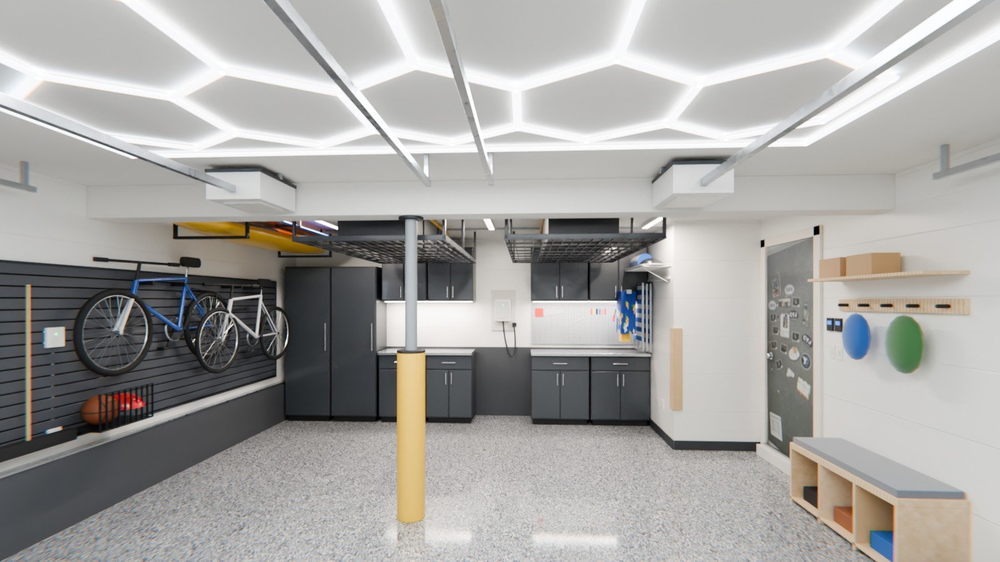

# Two-Bay Garage Makeover

An interactive 3D model of the garage, rebuilt from 6 photos and 2 walkthrough
videos, with a planner for renovating the walls, shelves and storage.

Open `index.html` in a browser. It is a single file: the model, textures and
reference photos are all inside it. three.js and the fonts load from public CDNs.

## What's in it

- **3D model.** The two 8 ft doors with their tracks, springs and openers, the
  steel column and beam, the window wall with the bikes and concrete curb, the
  plywood built-ins with the EV charger and tool pegboard, the house door with
  its magnet board, the peg rail, and the new flake floor (chip colors sampled
  from the photos). Drag to orbit, scroll or pinch to zoom, right-drag to pan.
  Walls between you and the room hide automatically, dollhouse style.
- **Now / Plan.** Flip between the garage as photographed and your selections.
- **Your photos.** Each thumbnail flies the camera to about where the photo was
  taken, with the photo beside the model for comparison.
- **Notes.** Pins for things that affect the work: the water-damaged drywall by
  the house door, the poured-concrete walls, the EV charger, the door tracks and
  the structural column.
- **Planner.** Four starting plans (as photographed, weekend refresh, organized,
  showroom) or mix your own:
  - Walls: as is, paint refresh (Sherwin-Williams colors, optional dark band up
    to the window sill), or Trusscore PVC boards; seal and color the concrete.
  - Back-wall shelves: keep, refresh the built-ins, steel racks with a workbench,
    or a steel cabinet wall.
  - Bike wall: as is, Steadyrack pivot racks, or slatwall.
  - House-door wall: as is, sports slatwall, or a mudroom-style drop zone.
  - Overhead racks, lighting (fluorescent, LED shop lights, hex grid) and a
    column wrap.
- **Shopping list.** Quantities are computed from the model's wall areas, with
  typical price ranges and store-search links. Copy it as plain text.

The ceiling is 97 in. (8′-1″), measured on site; width and depth (19′-0″ × 22′-0″) are estimated from the photos. Use
**Edit size** in the planner to enter measured numbers; the model and the
quantities update. Prices are typical US retail ranges, not quotes.

## Blender version

`blender/garage.blend` is a photoreal version of the same garage, with each plan
set up as a view layer. It uses path-traced lighting and procedural materials.
Rendered stills are in `blender/renders/`. See [blender/README.md](blender/README.md).



## Editing

| Path | What it holds |
| --- | --- |
| `src/garage.html` | Markup and CSS |
| `src/app.js` | The 3D scene, options, product catalog and cost model |
| `src/assets/` | Door-board and window textures and reference thumbnails cut from the photos |
| `build.py` | Inlines the script and images into `index.html` |

After changing anything in `src/`, rebuild:

```sh
python3 build.py
```
