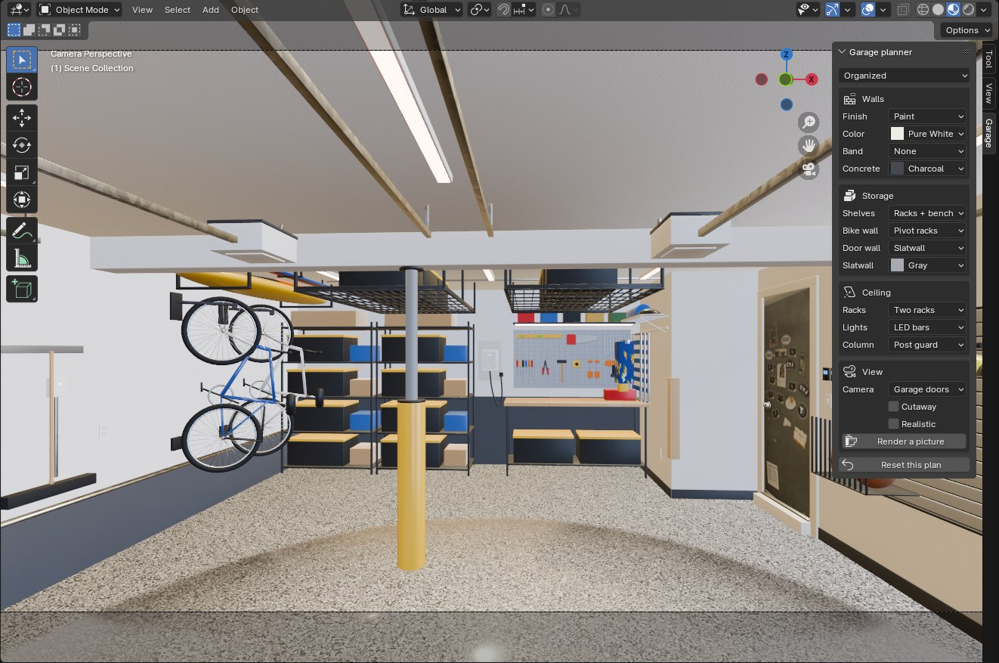
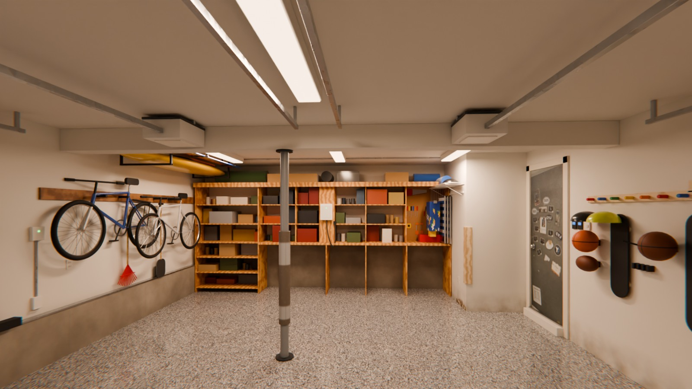
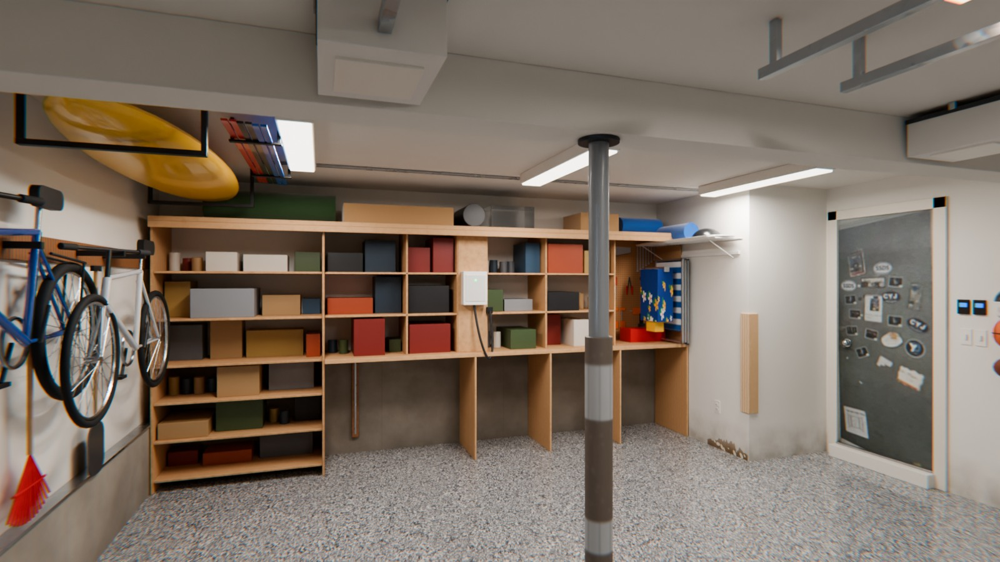
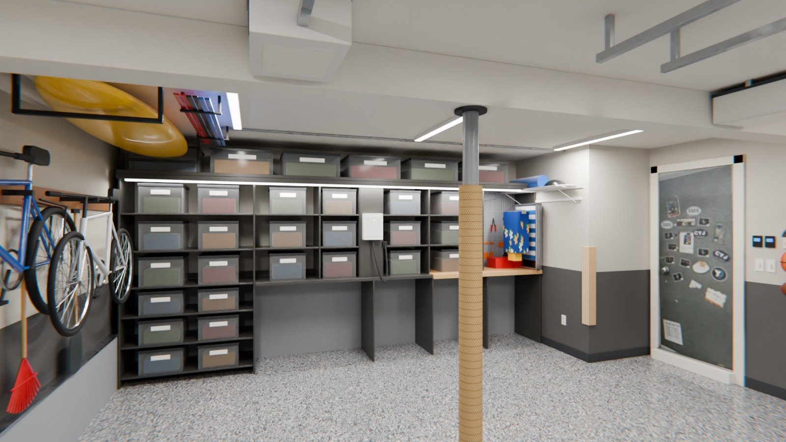
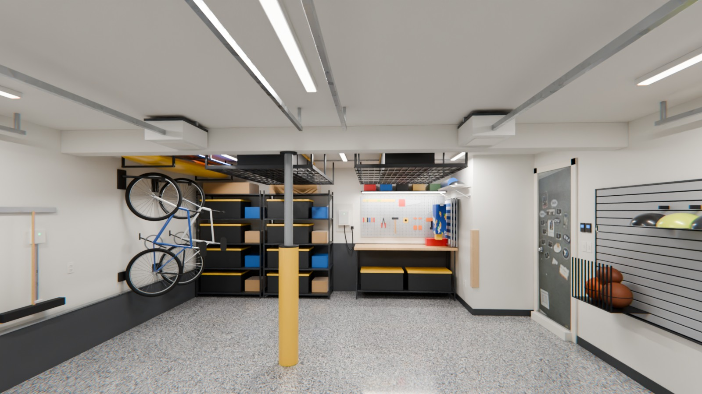
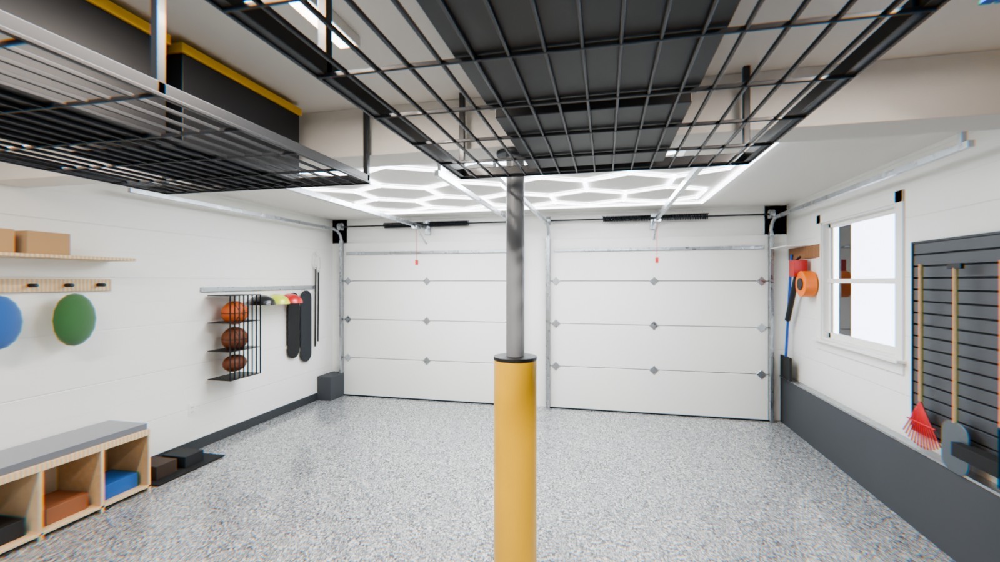
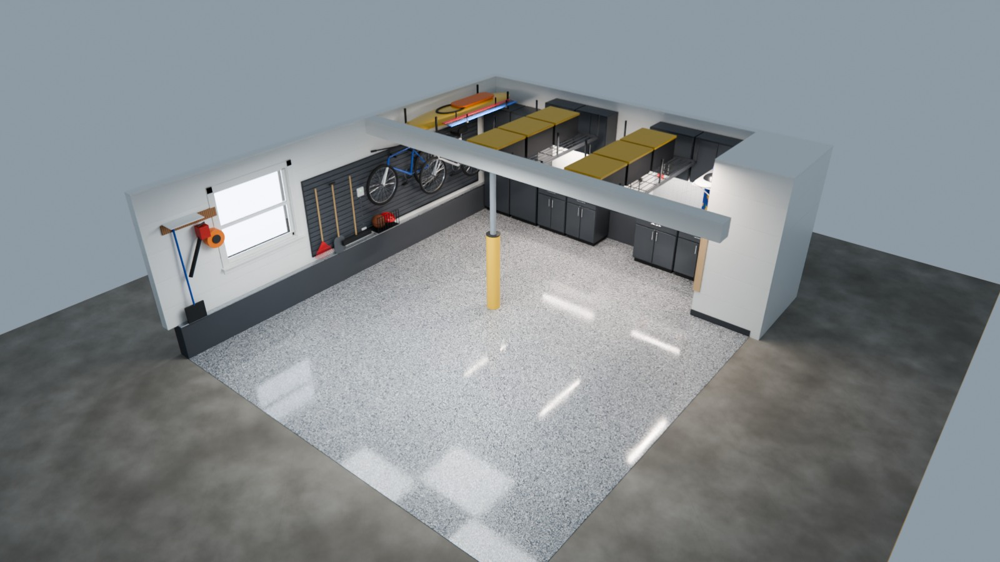

# Two-Bay Garage in Blender

`garage.blend` is a photoreal Blender model of the garage, with a **Garage** tab
for trying the same options as the web planner. It was built with Blender 4.5
LTS and opens in 4.5 or newer. Every texture is packed inside it.



## Opening it

1. Install [Blender](https://www.blender.org/download/). It's free for Windows,
   Mac and Linux. It doesn't run on phones; use the web planner there.
2. Open `garage.blend`.
3. Blender warns that the file contains a script. Click **Allow Execution**:
   the script is the Garage tab. You can read it in the **Scripting** workspace
   as `garage_planner.py`.
4. The view opens looking in from the garage doors, with the Garage tab at the
   right edge of the view. Press `N` if the sidebar is hidden.

If the Garage tab is missing, the script didn't run. Reopen the file and click
**Allow Execution**, or turn on **Edit → Preferences → Save & Load → Auto Run
Python Scripts**. Without the script the four plans are still there, in the
view-layer menu at the top right of the window, but you can't change them.

## Changing things

The Garage tab has the same choices as the web planner:

| Section | Choices |
| --- | --- |
| Plan | As photographed, Weekend refresh, Organized, Showroom |
| Walls | Finish (as is, paint, PVC boards), paint color and lower band (Sherwin-Williams), concrete curb and back wall |
| Storage | Back-wall shelves, built-in finish or cabinet color, bike wall, house-door wall, slatwall color |
| Ceiling | Overhead racks, lights, column wrap |
| View | Camera, cutaway, realistic lighting, **Render a picture** |

The color menus show a swatch, and hovering over any choice shows its full
name. Each plan keeps its own changes. **Reset this plan** puts it back the
way it started. Save the file (`Ctrl+S`) to keep your changes.

The view starts in Material Preview, which is quick. Tick **Realistic** (or
press `Z` → Rendered) for the path-traced lighting: it starts grainy and
cleans up over a few seconds. **Render a picture** (`F12`) makes a
full-quality still. Save it from the render window with **Image → Save As**.

To look around, drag with the middle mouse button to orbit, scroll to zoom and
Shift + middle-drag to pan. On a trackpad, drag the axis gizmo at the top right
of the view instead. Picking a camera in the Garage tab, or pressing
`Numpad 0`, goes back to the camera.

## How the file is organized

Each plan is a **view layer**, with a **· cutaway** twin that hides the
ceiling, the garage-door wall and the east wall. The Garage tab edits both.
Each option (walls, concrete, shelves, bike wall, house-door wall, overhead
racks, lighting, column) is a collection under **Garage** in the Outliner, and
a plan's view layer includes the ones it uses.

Colors are custom properties on each view layer (`garage_wall`,
`garage_band`, `garage_curb`, `garage_builtin`, `garage_cab`, `garage_slat`),
which the materials read with Attribute nodes, so every plan shows its own
colors even with scripts off. The scene holds fallbacks for any new view layer.

## Cameras and rendering

The **Cameras** collection has eye-level views from the garage doors, the back
wall, the bike wall, the house door, and toward the doors. It also has the
cutaway overview.

Rendering is set up for Cycles: path tracing with OpenImageDenoise, the AgX view
transform, and a slight vignette and lens fringe in the compositor. Lights are
real area lights sized to the fixtures. Daylight comes in through the window,
where the view outside is your own photo of the yard. On a GPU, raise the
samples in Render Properties for cleaner stills.

White balance (Color Management) is on. It is set most of the way to the color
of the lights, as a phone camera would set it, and the Garage tab sets it for
each plan's lights: the 4400 K fluorescent tubes, the 5000 K LED shop lights,
or the hex grid's mix of 5000 K and 6000 K. Blender shows a slightly higher
temperature than the lights, which leaves in a little warmth.

## Renders

These stills in `renders/` were rendered at 1600×900 on a 4-core CPU at 64
samples.

| | |
| --- | --- |
| <br>As photographed, from the garage doors | <br>As photographed, the back wall |
| <br>Weekend refresh, the back wall | <br>Organized, from the garage doors |
| <br>Showroom, from the garage doors | <br>Showroom, toward the garage doors |
| <br>Showroom cutaway | |

## Materials

All large surfaces use procedural shaders, so they stay sharp up close:

- The chip-flake floor has a glossy topcoat, with chip colors sampled from your photos.
- The walls have an orange-peel paint texture and grime near the floor.
- The foundation concrete is board-formed with pores and seams.
- Wood grain, galvanized spangle and a textured-plaster ceiling are procedural too.

The house door's magnet board and the pegboard tools are image textures in
`textures/`.

## Rebuilding

`build_garage.py` generates the whole file, so the layout can change in one
place. It uses the same measurements as the web model: 19′-0″ × 22′-0″, with a
97 in. ceiling measured on site. `garage_planner.py` defines the options, the
plans and the Garage tab; the build embeds it in the file.

```sh
pip install "bpy==4.5.*"
python3 blender/build_garage.py                                   # writes blender/garage.blend
python3 blender/build_garage.py --render renders --res 1600x900   # plus the stills
```

It also runs inside Blender: `blender --background --python blender/build_garage.py -- --render renders`.
